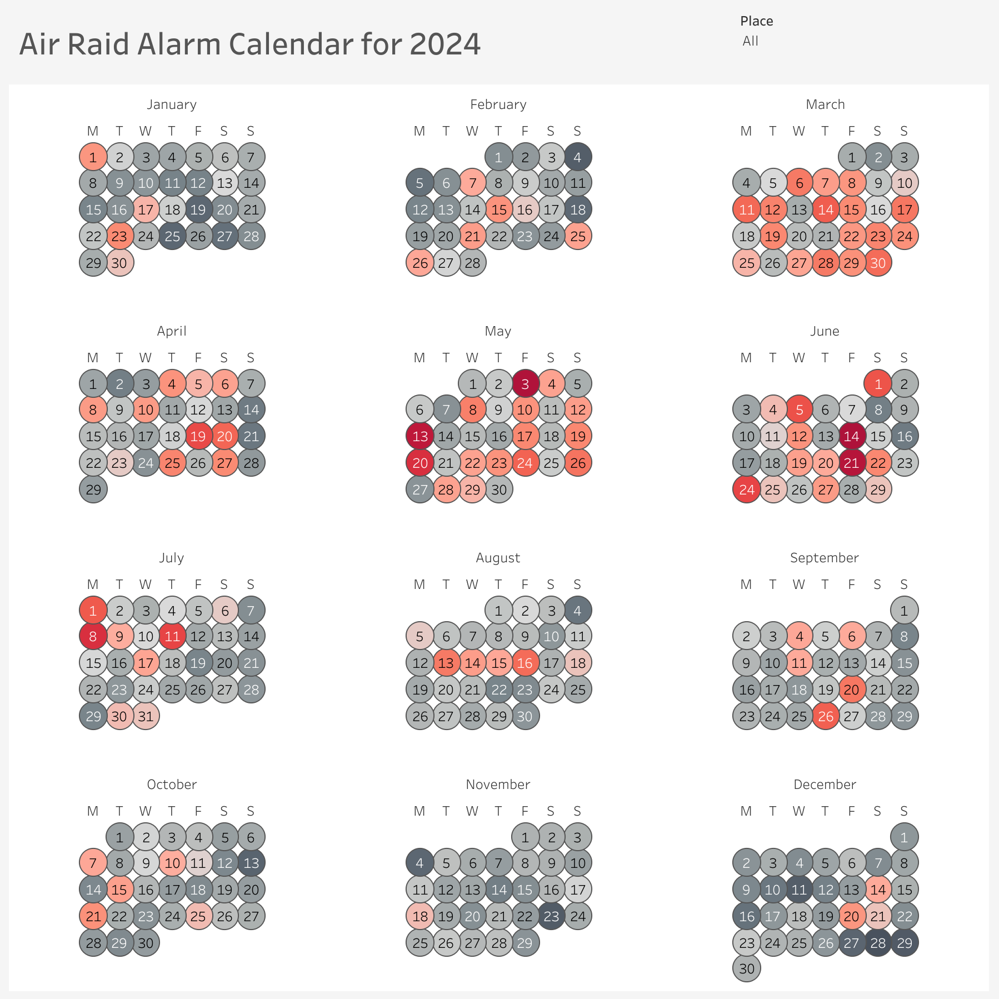

# Обробка JSON файлів та аналіз даних

Цей проект призначений для обробки JSON файлів, які містять дані про повідомлення (зазвичай з інформацією про тривогу або відбій тривоги), а також для перетворення їх в зручний для аналізу формат.

## Опис

Програма:

1. Читає JSON файли, що містять повідомлення, з вказаної директорії.
2. Обробляє повідомлення, витягуючи важливу інформацію: дату та час, місце (якщо вказано в хештегах), та тип повідомлення (Повітряна тривога або Відбій тривоги).
3. Перетворює отриману інформацію в таблицю у форматі CSV для подальшого аналізу.
4. Зберігає результат в файл `processed_data.csv`.

Крім того, ви можете переглядати графік календаря, створений на основі цих даних, в Tableau.

Дані для цього проекту були взяті з [Kaggle](https://www.kaggle.com/), за що велика подяка автору набору даних.

## Функціональність

### Основні функції:

- **process_json_file(file_path)** — обробляє один JSON файл, витягуючи з нього дані про дату та час, місце, тип повідомлення і зберігає ці дані в зручному форматі.
- **process_multiple_json_files(directory_path)** — обробляє всі JSON файли в зазначеній директорії та об'єднує результати в один DataFrame.
- **Збереження результату** — програма зберігає оброблені дані у файл `processed_data.csv`, що зручно для подальшого аналізу або візуалізації.

### Приклад використання:

1. Завантажте файли у форматі JSON до директорії `./archive`.
2. Запустіть програму, і вона автоматично обробить всі JSON файли в директорії.
3. Отриманий файл `processed_data.csv` міститиме оброблені дані про тривоги та відбої.

### Залежності:

- **glob** — для пошуку файлів у директорії.
- **json** — для парсингу JSON файлів.
- **pandas** — для роботи з таблицями та збереження результату в CSV.
- **datetime** — для роботи з датами та часами.
- **re** — для пошуку хештегів у тексті повідомлень.

### Приклад виводу:

```csv
Дата та час, Місце, Тип повідомлення
2025-03-01 12:00:00, м. Київ, Повітряна тривога
2025-03-01 14:00:00, м. Львів, Відбій тривоги
```

## Візуалізація даних

Дані також можна візуалізувати в Tableau. Я створила графік календаря, який показує дати, коли відбувалися тривоги та відбої. Ви можете переглянути інтерактивний графік за посиланням нижче:

[Посилання на Tableau графік](https://public.tableau.com/views/AirRaidAlarmCalendarfor2024/Dashboard1?:language=en-US&:sid=&:redirect=auth&:display_count=n&:origin=viz_share_link)

### Інтерактивність графіка
- **Hover:** Коли ви наводите курсор на будь-який день на графіку, можна побачити кількість повітряних тривог за цей день.
- **Фільтр по місцю:** На графіку є фільтр, за допомогою якого можна вибрати конкретну область або кілька областей. Це дозволяє детальніше побачити кількість повітряних тривог для окремих регіонів.
- **Кольорова гамма днів:** Кольори днів на графіку поступово змінюються від світло-сірого до червоного в залежності від кількості тривог.

Нижче ви можете побачити зображення з календарем з Tableau:

